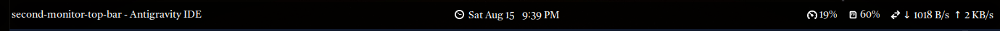

# Second Monitor Top Bar — GNOME Shell Extension

**A top panel for every non-primary monitor on GNOME 42.** GNOME only draws its top bar on the primary display — this extension adds a fully functional second bar to each of your other monitors, with the clock, the focused app, and live CPU / RAM / network stats. Built for **Ubuntu 22.04 LTS**, works on **X11 and Wayland**, and has **zero dependencies** (no other extensions, no libraries, no GTop).




*Left: focused app (icon + name) · Center: clock · Right: CPU, RAM, network*

---

## Why

Stock GNOME Shell shows the top bar on the **primary monitor only**. If you work with two or more displays, your secondary screen has no clock, no status, nothing. Existing multi-monitor add-ons are big, pull in extra dependencies, or fight with each other.

This extension does one thing well: **a real, native-looking panel on every secondary monitor**, built with the same mechanisms the shell itself uses — so it matches your theme (Yaru, Orchis, Adwaita, dark or light), follows your clock settings, and **maximized windows respect it** (the panel reserves space via per-monitor struts, exactly like the real top bar).

## Features

| Slot | What you get |
|------|--------------|
| **Left** | Icon + application **name** of the window focused on that monitor (per-monitor and sticky — survives focus moving to another screen, clears when the window closes) |
| **Center** | Clock — identical text and behavior to the primary bar's clock: 12/24-hour, date, seconds, all from your GNOME settings |
| **Right** | Live **CPU %**, **RAM %** and **network ↓/↑ rates**, each with a symbolic icon, sampled every 2 seconds |

- **Native look** — the panel reuses the shell theme's own `#panel` styling, so it automatically matches any GNOME theme, including custom ones
- **Real window management** — chrome struts are registered per monitor, so maximized and tiled windows stop below the bar instead of sliding under it
- **Hot-plug safe** — plug/unplug monitors, change resolutions, rearrange displays or switch the primary: the bars rebuild automatically (`monitors-changed`, debounced)
- **Clean teardown** — enabling/disabling/uninstalling removes all actors, struts, timers and signal handlers; no leftovers, no leaks
- **Lock-screen aware** — bars hide while the session is locked
- **No dependencies** — everything is built from `St`/`Clutter`/`Shell` and sampled straight from `/proc`
- **Doesn't touch the primary panel** — your main top bar is never modified

## Compatibility

- **GNOME Shell 42.x** — Ubuntu 22.04 LTS, Fedora 36, Debian 12 (GNOME 42 era)
- **X11 and Wayland** sessions
- Not compatible with GNOME 45+ (which moved extensions to ES modules) — a port would be straightforward if anyone wants it

## Install

### From this repository

```bash
git clone https://github.com/HridoyVaraby/second-monitor-top-bar.git
cd second-monitor-top-bar
./tools/install.sh
```

The script installs to `~/.local/share/gnome-shell/extensions/second-monitor-top-bar@hridoyvaraby/` — user-level only, nothing system-wide.

### Manual install

```bash
mkdir -p ~/.local/share/gnome-shell/extensions/second-monitor-top-bar@hridoyvaraby
cp extension.js metadata.json stylesheet.css \
   ~/.local/share/gnome-shell/extensions/second-monitor-top-bar@hridoyvaraby/
```

### Activate

GNOME Shell only scans for new extensions at startup, so after the **first** install:

1. Restart the shell:
   - **X11:** press `Alt+F2`, type `r`, press `Enter`
   - **Wayland:** log out and back in
2. Enable the extension:

```bash
gnome-extensions enable second-monitor-top-bar@hridoyvaraby
```

The bar appears immediately on every connected non-primary monitor.

## Configuration

All options live in the `Config` object at the top of [extension.js](extension.js). After editing, re-run `./tools/install.sh` and restart the shell as above.

| Key | Default | Description |
|-----|---------|-------------|
| `showApp` | `true` | Focused app icon + name (left slot) |
| `showClockIcon` | `true` | Small clock icon before the time |
| `showCpu` | `true` | CPU usage (right slot) |
| `showRam` | `true` | RAM usage (right slot) |
| `showNet` | `true` | Network down/up rates (right slot) |
| `updateIntervalSec` | `2` | System info sampling period, in seconds |
| `iconSize` | `16` | Focused-app icon size in px |
| `infoIconSize` | `14` | CPU/RAM/NET/clock icon size in px |

## How it works

Interesting bits for extension developers — everything was verified against the GNOME Shell 42.9 source:

- **Panel actor** — an `St.Widget` named `panel` (picks up the theme's `#panel` rules) with a custom `vfunc_allocate` that carves non-overlapping left/center/right slots, the same technique `ui/panel.js` uses
- **Placement & struts** — each panel is added via `Main.layoutManager.addChrome(actor, { affectsStruts: true })` and positioned at its monitor's top-left, mirroring how the shell positions `panelBox`. The layout manager converts a full-width top-edge chrome actor into a **per-monitor strut** (`_updateRegions`)
- **Clock** — `GnomeDesktop.WallClock` bound to an `St.Label` with `GObject.BindingFlags.SYNC_CREATE`, exactly like the date menu in `ui/dateMenu.js`, so all clock settings work for free
- **Focused app** — `Shell.WindowTracker.get_default().get_window_app()` per focus change, filtered to normal windows on that monitor
- **System stats** — one shared sampler reads `/proc/stat` (CPU deltas), `/proc/meminfo` (`MemAvailable`), and `/proc/net/dev` (per-interface counters, skipping `lo`/`veth`/`docker`); one timer drives every panel
- **Rebuilds** — `monitors-changed` is debounced to the next idle (display changes arrive in bursts), then all panels are rebuilt from `layoutManager.monitors`

## Troubleshooting

```bash
# Extension state (look for "State: ENABLED")
gnome-extensions info second-monitor-top-bar@hridoyvaraby

# Follow shell logs, errors included
./tools/logs.sh            # everything from gnome-shell
./tools/logs.sh --ext      # only this extension + JS errors
```

| Symptom | Fix |
|---------|-----|
| Nothing appears after install | The shell hasn't scanned the new extension — restart it (X11: `Alt+F2` → `r`; Wayland: log out/in), then enable |
| Bar disappears after code edits | `disable`/`enable` re-runs the old code — restart the shell to re-import it |
| No bar on the secondary monitor | It only draws on **non-primary** displays; check which monitor is primary in Settings → Displays |
| Stats show no values | The sampler reads `/proc` — verify with `cat /proc/stat` |

**Uninstall:**

```bash
gnome-extensions disable second-monitor-top-bar@hridoyvaraby
rm -rf ~/.local/share/gnome-shell/extensions/second-monitor-top-bar@hridoyvaraby
```

## Development notes

Dev loop on an X11 session:

```bash
./tools/install.sh     # refresh files + disable/enable cycle
# edit extension.js ...
# Alt+F2 -> r -> Enter  (restart the shell to load the new code)
./tools/logs.sh --ext
```

Reading the shell's own source on Ubuntu 22.04 (invaluable for API questions):

```bash
gresource extract /usr/lib/gnome-shell/libgnome-shell.so \
    /org/gnome/shell/ui/panel.js > /tmp/panel.js
```

GNOME 42 gotchas that cost us debugging cycles (all handled in this codebase):

- `St.BoxLayout.add(child, { expand, x_fill })` — the 3.x child-property API is gone; it throws `TypeError: meta is null`
- `Main.sessionMode.hasPanel` and `Main.windowTracker` don't exist on 42 (newer-shell exports); assigning `undefined` to `actor.visible` silently hides the actor
- `Clutter.BinLayout` + child `x_align` didn't lay out reliably — manual `vfunc_allocate` is the robust pattern

## Roadmap ideas

- Preferences dialog (GSettings schema) instead of editing `Config`
- Click actions: click the app name to raise its window
- Workspace indicator, media controls, volume
- GNOME 45+ port (ES modules)

## License

[MIT](LICENSE) — free to use, modify and redistribute.
